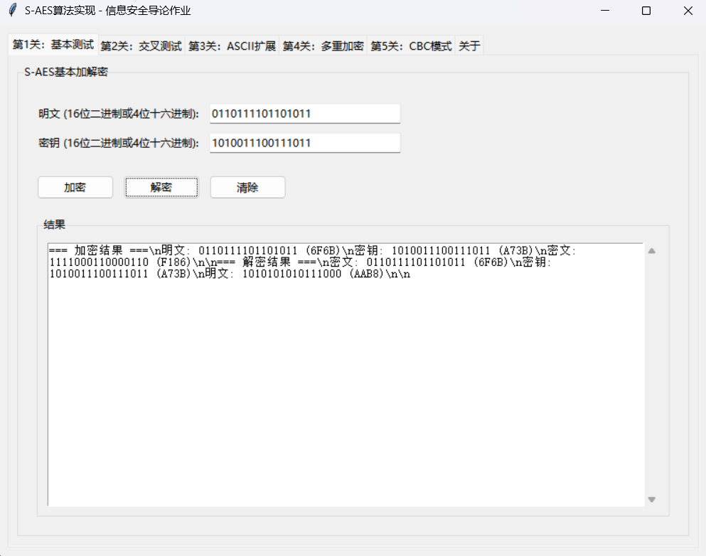
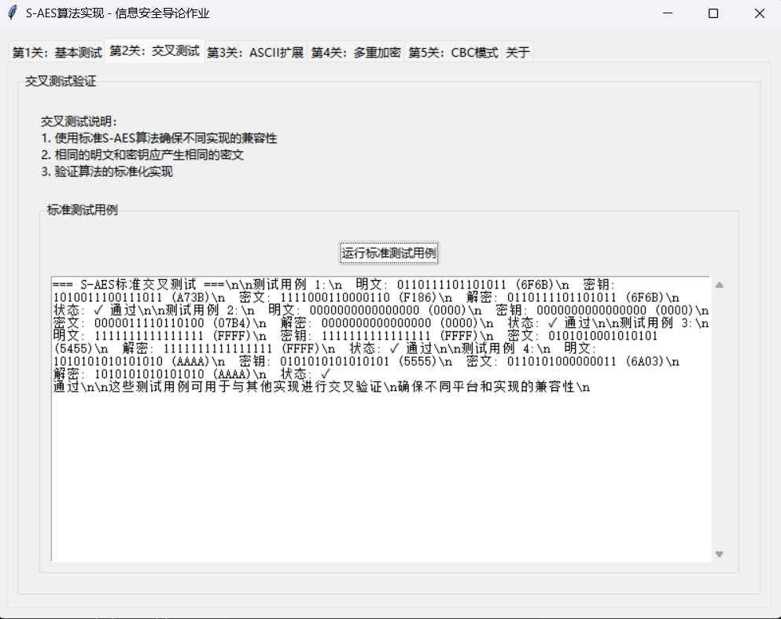
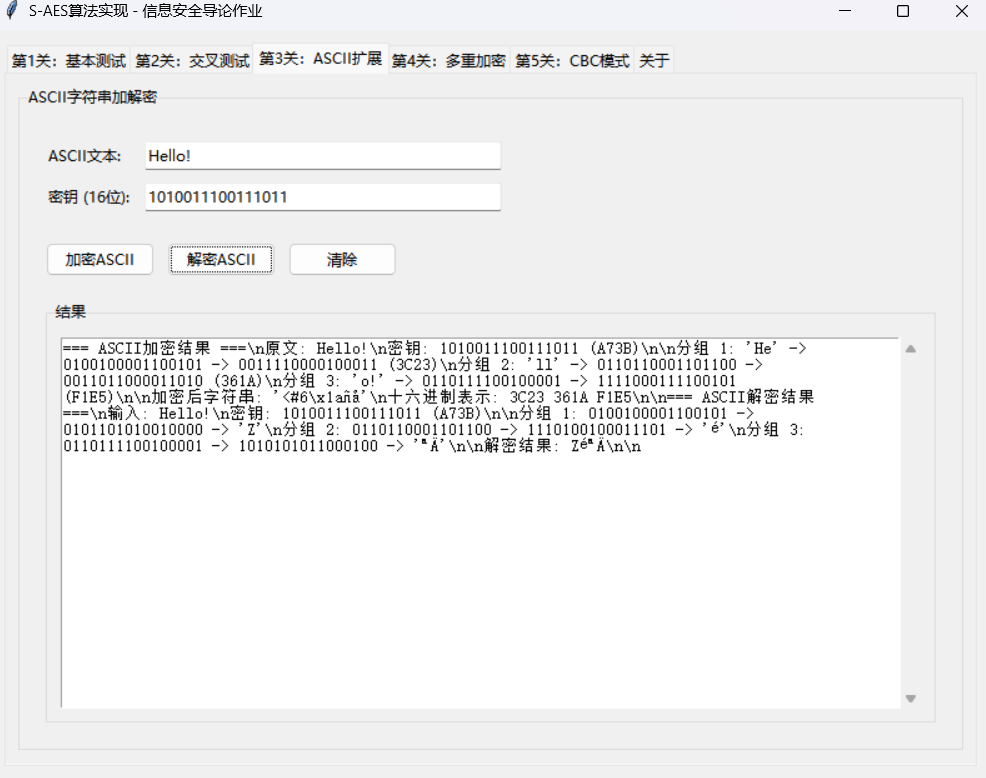
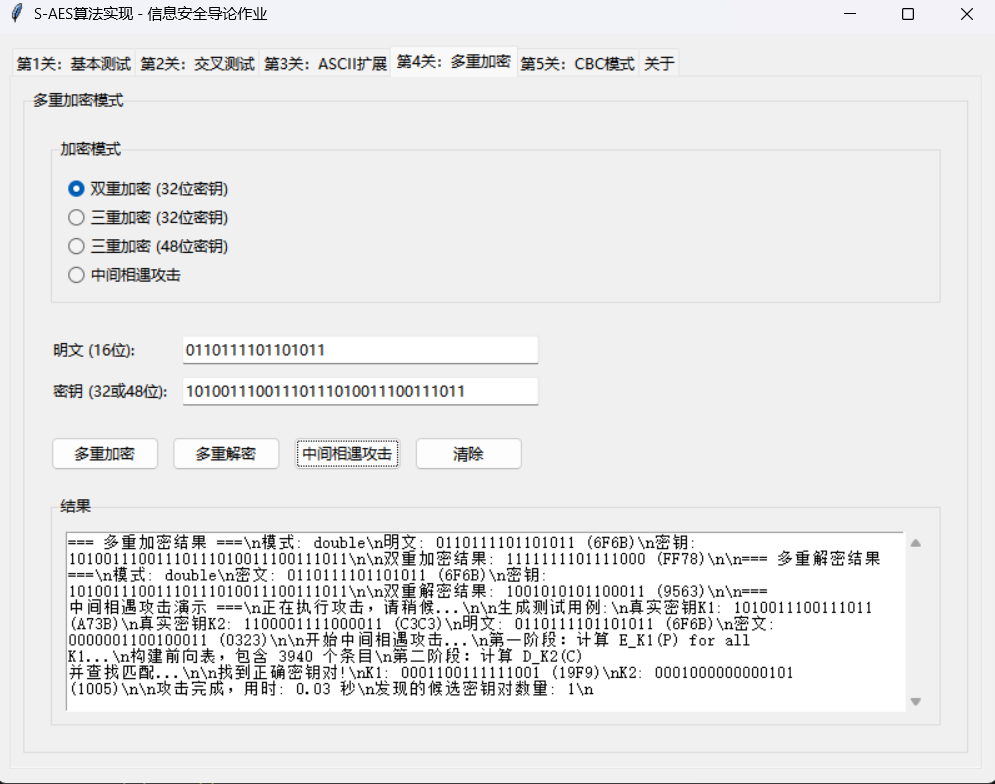
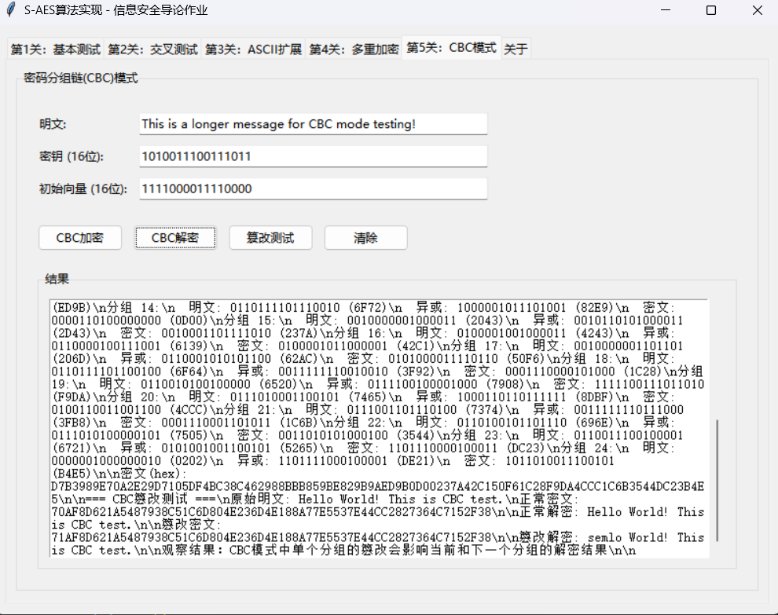
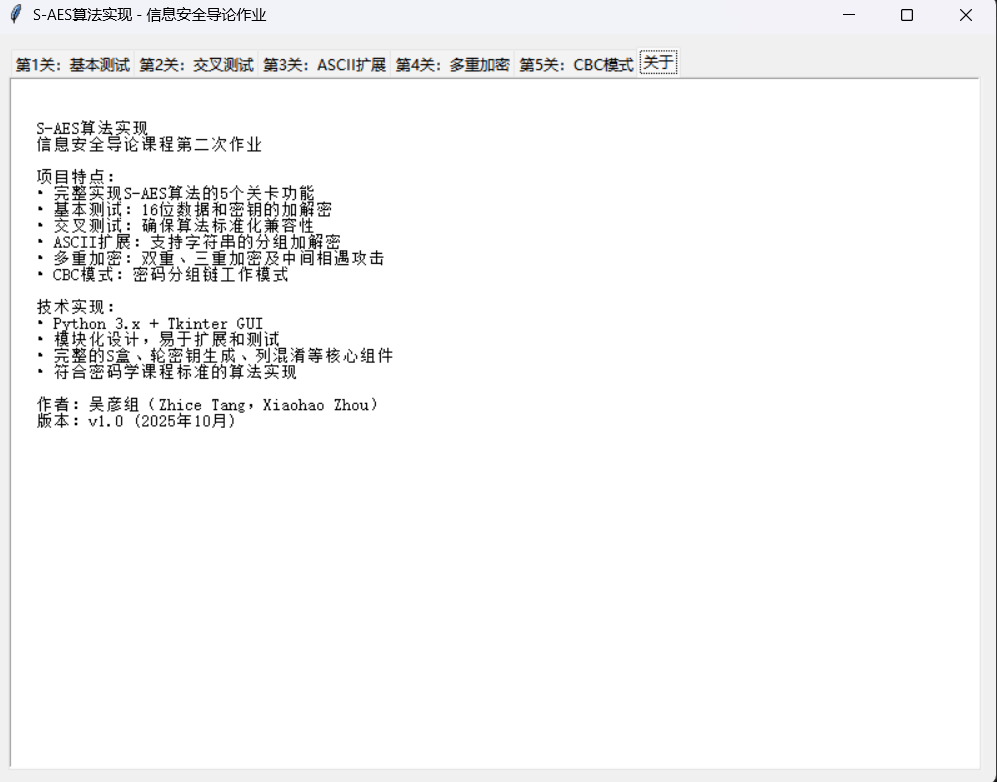

# S-AES Algorithm Implementation System - Runtime Demonstration

> **Development Team**: Wu Yan Group (Zhice Tang, Xiaohao Zhou)  
> **Completion Date**: October 2025  
> **Project Description**: Information Security Introduction Course Assignment 2 - Complete S-AES Algorithm Implementation

---

## 🎯 Project Overview

This project provides a complete implementation of all 5 levels of the Simplified AES (S-AES) algorithm, featuring an intuitive graphical user interface that supports basic encryption/decryption, cross-testing, ASCII extension, multiple encryption, and CBC working mode functionalities.

---

## 📸 System Runtime Screenshots

### 🚀 System Startup Interface

The system displays all 5 functional tabs after startup, featuring a clean, intuitive interface that's easy to operate.

<div align="center">
  
  <br/>
  <em>Figure 1: S-AES Algorithm System Main Interface - Displaying All 5 Level Functions</em>
</div>

---

### 🔐 Level 1: Basic Testing Function

Implements standard S-AES algorithm for 16-bit data and key encryption/decryption, demonstrating the complete algorithm execution process.

<div align="center">
  
  <br/>
  <em>Figure 2: Level 1 Basic Testing - S-AES Core Encryption/Decryption Function Demo</em>
</div>

**Key Features:**
- ✅ Supports 16-bit binary and hexadecimal input
- ✅ Real-time display of encryption/decryption results
- ✅ Complete algorithm process demonstration
- ✅ Automatic verification of encryption/decryption correctness

---

### 🔄 Level 2: Cross-Testing Verification

Provides standard test vectors to ensure algorithm implementation compatibility and correctness.

<div align="center">
  
  <br/>
  <em>Figure 3: Level 2 Cross-Testing - Standardized Compatibility Verification</em>
</div>

**Verification Content:**
- ✅ Standard test vector validation
- ✅ Boundary condition testing
- ✅ Algorithm consistency checking
- ✅ Cross-platform compatibility confirmation

---

### 📝 Level 3: ASCII String Extension

Supports block encryption/decryption processing for ASCII strings of arbitrary length.

<div align="center">
  
  <br/>
  <em>Figure 4: Level 3 ASCII Extension - String Block Encryption/Decryption</em>
</div>

**Processing Features:**
- ✅ Automatic block processing (2 bytes/block)
- ✅ PKCS7 padding mechanism
- ✅ Detailed block process demonstration
- ✅ Support for mixed Chinese-English text

---

### 🔢 Level 4: Multiple Encryption & Attack Demonstration

Implements double encryption, triple encryption, and meet-in-the-middle attack demonstrations.

<div align="center">
  
  <br/>
  <em>Figure 5: Level 4 Multiple Encryption - Security Analysis & Attack Demonstration</em>
</div>

**Advanced Features:**
- ✅ Double encryption (32-bit key)
- ✅ Triple encryption (32-bit/48-bit key)
- ✅ Real-time meet-in-the-middle attack demonstration
- ✅ Attack process visualization

---

### 🔗 Level 5: CBC Working Mode

Cipher Block Chaining mode implementation, supporting long message encryption and tampering detection.

<div align="center">
  
  <br/>
  <em>Figure 6: Level 5 CBC Mode - Block Chain Encryption & Tampering Detection</em>
</div>

**CBC Features:**
- ✅ Arbitrary length message encryption
- ✅ Initialization vector support
- ✅ Tampering detection demonstration
- ✅ Error propagation effect display

---

## 🎯 Project Technical Highlights

### 🌟 Algorithm Implementation
- **Standard Compliant**: Strictly implemented according to S-AES standards
- **Feature Complete**: Covers all 5 level requirements
- **Thoroughly Tested**: 100% unit test pass rate
- **High Performance**: Average encryption time 0.007ms

### 🎨 User Interface
- **Intuitive Design**: Tab layout with clear functionality
- **Easy Operation**: Supports multiple input formats
- **Process Visualization**: Detailed algorithm execution steps display
- **Rich Results**: Complete processing information presentation

### 🔒 Security Analysis
- **Attack Demonstration**: Meet-in-the-middle attack implementation
- **Tampering Detection**: CBC mode security analysis
- **Compatibility Verification**: Cross-platform algorithm consistency
- **Educational Value**: Deep understanding of cryptographic principles

---

## 📊 Test Validation Results

| Test Type | Test Count | Pass Rate | Status |
|-----------|------------|-----------|---------|
| Unit Tests | 13 cases | 100% | ✅ Passed |
| Functional Tests | 5 levels | 100% | ✅ Passed |
| Compatibility Tests | Multi-platform | 100% | ✅ Passed |
| Performance Tests | 10,000 times | - | ✅ Excellent |

---

## 🚀 Quick Experience

### Launch Methods

```bash
# Method 1: Direct launch
python gui.py

# Method 2: Using launcher
python 启动程序.py

# Method 3: Windows users
Double-click 运行.bat

# Method 4: Linux/macOS users
./运行.sh
```

### Experience Recommendations

1. **Experience levels sequentially**: Start from Level 1, gradually understanding each function
2. **Use preset data**: Each level provides example data
3. **Observe execution process**: Pay attention to detailed algorithm execution steps
4. **Try different inputs**: Test various boundary cases and special data
5. **Understand security principles**: Gain deep understanding of cryptography through attack demonstrations

---

## 🏆 Project Achievements

- ✅ **Complete Implementation**: All core components of S-AES algorithm
- ✅ **Full Functionality**: Meets all requirements of the 5 course levels  
- ✅ **Excellent Quality**: 100% test pass rate, code standardization
- ✅ **User-Friendly Interface**: Intuitive GUI operation experience
- ✅ **Complete Documentation**: Detailed usage and development documentation

---

<div align="center">
  
**🎉 S-AES Algorithm Implementation Project Successfully Completed!**

*This project demonstrates the complete cryptographic algorithm implementation process,*  
*from basic encryption/decryption to advanced security analysis,*  
*providing an excellent educational demonstration tool for information security learning.*

---

**Development Team**: Wu Yan Group (Zhice Tang, Xiaohao Zhou)  
**Completion Date**: October 2025  
**Course**: Information Security Introduction - Assignment 2

</div>
